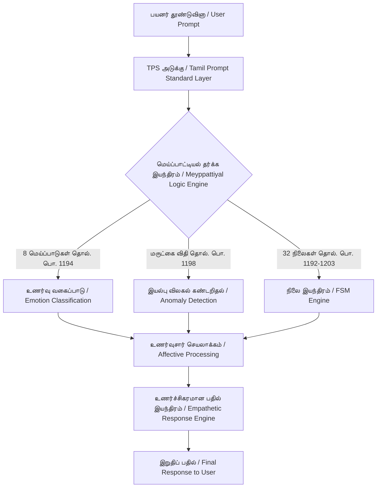
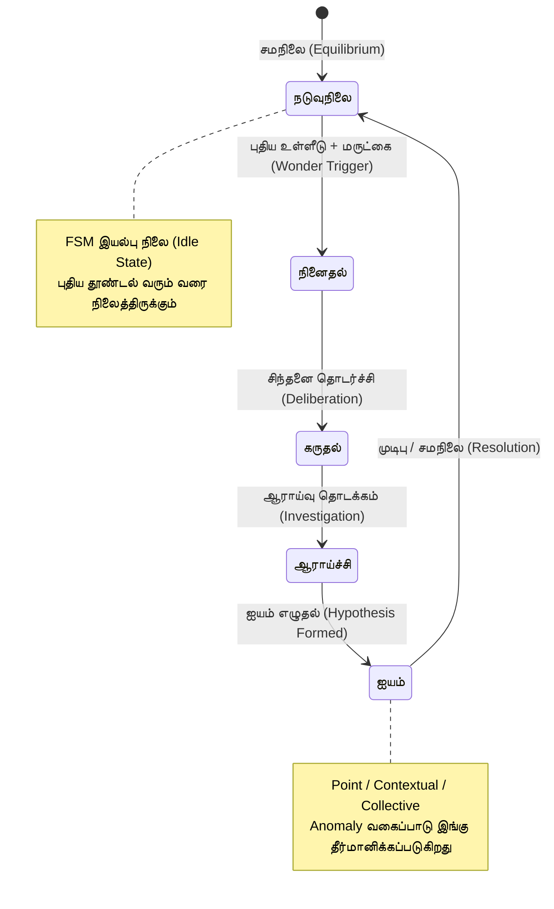
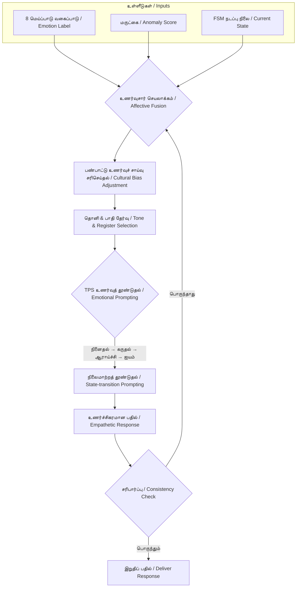
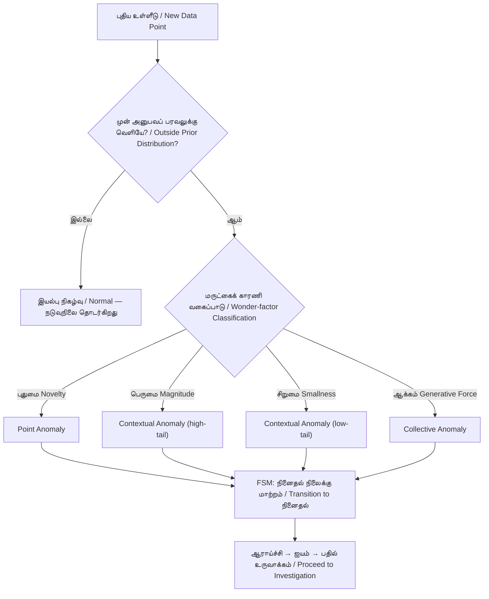
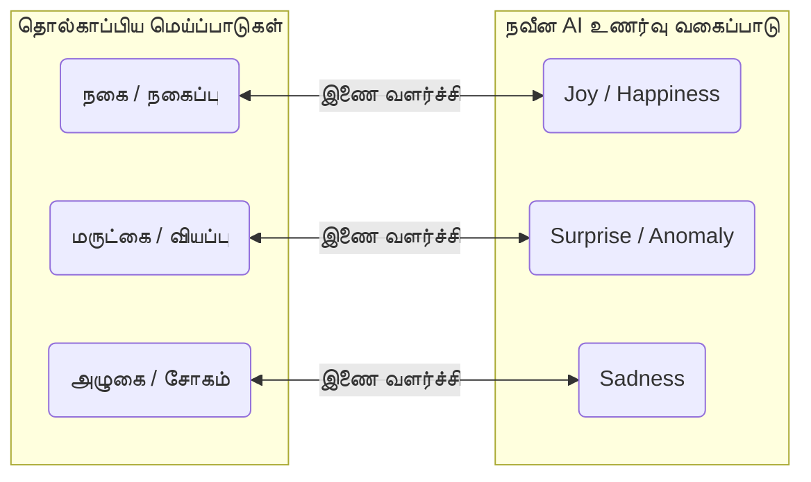
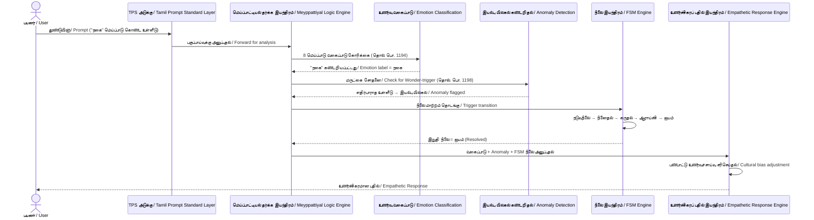
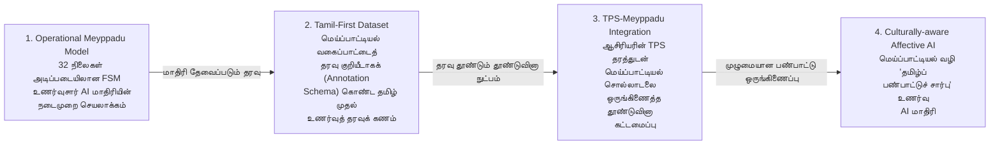

# கட்டமைப்பு வரைபடங்கள் (Architecture Diagrams)

இக்கோவை, தொ.மா.2098 கட்டுரையில் (*"செய்யறிவும் செம்மொழியும்"*) விவரிக்கப்படும் மெய்ப்பாட்டியல்-சார்ந்த உணர்வுசார் AI கட்டமைப்பின் (Affective AI Architecture) கூறு வரைபடங்களை ஒருங்கே தொகுக்கிறது: (1) முழுமையான அமைப்புக் கட்டமைப்பு, (2) நிலை இயந்திர (FSM) வரைபடம், (3) உணர்ச்சிகரப் பதில் இயந்திரம் (Empathetic Response Engine), (4) இயல்பு விலகல் கண்டறிதல் (Anomaly Detection) ஓட்டம், (5) மெய்ப்பாடு-நவீனக் கோட்பாடு ஒப்பீடு (Conceptual Mapping) மற்றும் 32 நிலைகளின் விளக்கப்படம், (6) அரட்டை இயலி இயக்க வரிசை வரைபடம் (Sequence Diagram), (7) எதிர்கால ஆய்வுத் திசைகளின் வரிசை வரைபடம் (Future-work Roadmap). மூலக் கட்டுரையின் §5.4-இல் உள்ள `system-architecture.mmd` மற்றும் `state-transition.mmd` கோப்புகளுடன் ஒத்திசைவாக வரையப்பட்டவை; கருத்தாக்க மேற்கோள்கள் தொல். பொ. 1192-1218 (மெய்ப்பாட்டியல்) அடிப்படையில்.

> குறிப்பு: "இணை வளர்ச்சி" (Parallel Development) நெறிமுறையின்படி, இவை தொல்காப்பியமும் நவீன AI-யும் **ஒரே கருத்தாக்கக் கட்டமைப்பை** தனித்தனியே அடைந்துள்ளதைக் காட்டும் விளக்கப் படங்களே — நேரடிச் சமன்பாடு அன்று.

## ஊடாடும் வரைபடங்கள் / Interactive Diagrams

| வரைபடம் / Diagram | விளக்கம் / Scope | திறக்க / Open |
|---|---|---|
| முழுமையான அமைப்புக் கட்டமைப்பு / Full system architecture | TPS அடுக்கு முதல் உணர்ச்சிகரமான இறுதிப் பதில் வரையிலான கூறுகளும் தகவல் ஓட்டமும் | [system-architecture.html](system-architecture.html) |
| அரட்டை இயலி இயக்க வரிசை / Chatbot runtime | பயனர் தூண்டுவினா, வகைப்பாடு, இயல்பு விலகல் சோதனை, FSM, பதில் உருவாக்கம் ஆகியவற்றின் காலவரிசை | [chatbot-runtime.html](chatbot-runtime.html) |
| இயல்பு விலகல் கண்டறிதல் / Anomaly detection | மருட்கைக் காரணிகளையும் நவீன இயல்பு விலகல் வகைகளையும் இணைக்கும் முடிவெடுப்பு ஓட்டம் | [anomaly-detection.html](anomaly-detection.html) |

இந்தத் தனித்த HTML கோப்புகளில் ஒளி/இருள் தோற்றம், பெரிதாக்கம், தேடல், கூறு மையப்படுத்தல், தொடர்புத் தடமறிதல், ஏற்றுமதி ஆகிய வசதிகள் உள்ளன.

---

## 1. முழுமையான அமைப்புக் கட்டமைப்பு (Full System Architecture)

பயனர் தூண்டுவினா (Prompt) TPS அடுக்கு வழியாகச் சென்று, மெய்ப்பாட்டியல் தர்க்க இயந்திரத்தின் மூன்று உள்கூறுகளால் (8 மெய்ப்பாடுகள், மருட்கை விதி, 32 நிலைகள்) செயலாக்கப்பட்டு, இறுதியில் உணர்ச்சிகரமான பதிலாக வெளிப்படும் முழு ஓட்டம்.

**கூறு வரைபடம் மூலம்:** [../diagrams/system-architecture.mmd](../diagrams/system-architecture.mmd)

---

## 2. நிலை இயந்திர வரைபடம் (Meyppaattiyal State Machine — FSM)

மருட்கை (Wonder/Surprise) தூண்டல் ஏற்படும்போது மனம் நடுவுநிலையிலிருந்து விலகி, சிந்தனைச் சுழற்சி வழியாக மீண்டும் சமநிலை அடையும் ஐந்து-நிலைச் சுழற்சி (தொல். பொ. 1203).

**கூறு வரைபடம் மூலம்:** [../diagrams/state-transition.mmd](../diagrams/state-transition.mmd)

---

## 3. உணர்ச்சிகரப் பதில் இயந்திரம் (Empathetic Response Engine)

உணர்வு வகைப்பாடு, இயல்பு விலகல் கண்டறிதல், FSM நிலை ஆகிய மூன்று உள்ளீடுகளும் ஒன்றிணைந்து, பண்பாட்டு உணர்வுச் சாய்வுகளைக் (Cultural Sensitivity) கருத்தில் கொண்டு இறுதிப் பதிலை உருவாக்கும் விரிவான உட்-கட்டமைப்பு.

**செயல்பாட்டு விளக்கம்:** ஒரு செய்யறிவு அரட்டை இயலி (AI Chatbot) "நகை" மெய்ப்பாட்டைக் கண்டறிந்து, எதிர்பாராத உள்ளீட்டை "மருட்கை"யாக இயல்பு விலகலாகக் குறித்து, பின் FSM பாதையில் இயங்கி, பண்பாட்டு உணர்வுச் சாய்வுகளுக்கு ஏற்ப தொனியைச் சரிசெய்து இறுதிப் பதிலை வழங்கும் ஓட்டம் (§5.4, §6.2 காண்க).

---

## 4. இயல்பு விலகல் கண்டறிதல் ஓட்டம் (Anomaly Detection — மருட்கை Pipeline)

மருட்கையின் நான்கு காரணிகளும் (தொல். பொ. 1198) சாந்தோலா முதலியோர் (2009) வரையறுத்த மூன்று Anomaly வகைகளுடன் இணைந்து முடிவெடுக்கும் தீர்மான மரம் (Decision Tree).

**அட்டவணை மூலம்:** §5.2, அட்டவணை 2 (மருட்கைக் காரணி ↔ Anomaly வகை ஒப்புமை).

---

## 5. மெய்ப்பாடு - நவீனக் கோட்பாடு ஒப்பீடு (Conceptual Mapping)

தொல்காப்பிய மெய்ப்பாடுகளுக்கும் நவீன உணர்வுசார் கணினியியல் (Affective Computing) கருத்தாக்கங்களுக்கும் இடையிலான இணை வளர்ச்சி ஒப்புமை.

**கட்டுரை மூலம்:** [../paper/paper.md](../paper/paper.md) §5.

### 32 நிலைகளின் வகைப்பாட்டு விளக்கப்படம் (32 Mental States Illustration)

தொல். பொ. 1192-1203-இல் வரையறுக்கப்பட்ட 32 நிலைகளை உடல்/சூழல்சார், உணர்வுசார், அறிவுசார் என மூன்று குழுக்களாக (§5.3.1) காட்சிப்படுத்தும் விளக்கப் படம்.

32 நிலைகளின் உடல்/சூழல்சார், உணர்வுசார், அறிவுசார் வகைப்பாட்டுப் பட்டியல் [முழுக் கட்டுரையின் §5.3.1](../paper/paper.md)-இல் தரப்பட்டுள்ளது.

---

## 6. அரட்டை இயலி இயக்க வரிசை வரைபடம் (AI Chatbot Runtime — Sequence Diagram)

§5.4-இல் (§121) விவரிக்கப்படும் நடைமுறை நிகழ்வை — ஒரு செய்யறிவு அரட்டை இயலி பயனரின் தூண்டுவினாவை மெய்ப்பாட்டியல் தர்க்கத்தின் மூன்று உள்கூறுகள் வழியாகச் செலுத்தி உணர்ச்சிகரமான பதிலாக மாற்றும் காலவரிசை — கூறு-கூறாகக் காட்டும் Sequence Diagram.

**செயல்பாட்டு விளக்கம்:** இந்த வரைபடம் §1 (System Architecture), §2 (FSM), §3 (Empathetic Response Engine) ஆகிய மூன்று கட்டமைப்பு வரைபடங்களையும் **ஒரு காலவரிசை ஓட்டமாக** (temporal flow) இணைத்துக் காட்டுகிறது — கூறுகளுக்கு இடையேயான தகவல் பரிமாற்ற வரிசையை தெளிவுபடுத்துகிறது.

---

## 7. எதிர்கால ஆய்வுத் திசைகளின் வரிசை வரைபடம் (§7 Future-work Roadmap)

§7-இல் முன்மொழியப்பட்ட நான்கு எதிர்கால ஆய்வுத் திசைகளும் ஒரு தொடர் சார்பு (sequential dependency) கொண்டவை — ஒவ்வொன்றும் முந்தையதன் அடிப்படையில் கட்டமைக்கப்படக்கூடியவை.

**செயல்பாட்டு விளக்கம்:** R1 (FSM மாதிரி செயலாக்கம்) இல்லாமல் R2 (தரவுக் கணம் வகைப்படுத்த) நடைமுறையில் சாத்தியமில்லை; R2 இல்லாமல் R3-இன் தூண்டுவினா நுட்பத்தை பயிற்சி/சரிபார்ப்பு செய்ய முடியாது; R3 முழுமையாகும்போதே R4-இன் பண்பாட்டு அடுக்கு பொருத்தமாக அமையும். இக்கட்டமைப்பு கட்டுரையின் §7-இல் பட்டியலாக மட்டும் தரப்பட்ட நான்கு திசைகளுக்கும் இடையேயான தர்க்கரீதியான வரிசையை வெளிப்படுத்துகிறது.

---

## மேற்கோள் / References

- தொல்காப்பியர். *தொல்காப்பியம்: பொருளதிகாரம், மெய்ப்பாட்டியல்* (புலியூர்க் கேசிகன் உரை, 1961). நூற்பா 1192-1218.
- Chandola, V., Banerjee, A., & Kumar, V. (2009). Anomaly detection: A survey. *ACM Computing Surveys*, *41*(3), 1-58.
- Picard, R. W. (1997). *Affective Computing*. MIT Press.
- Ekman, P., & Friesen, W. V. (1978). *Facial Action Coding System (FACS)*.
- Kring, A. M. (2023). *The Facial Expression Coding System (FACES): A user's guide*. ESI Lab, UC Berkeley.

முழு விவரம்: [../paper/paper.md](../paper/paper.md) §5.
